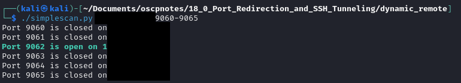

### A very simple aggressor script full of aliases I created due to laziness, and fumbled copy pastes.
### A super simple portscanner leveraging proxychains to look for open ports.  I'm sure you could use other automated tooling, but I needed a quick project!

